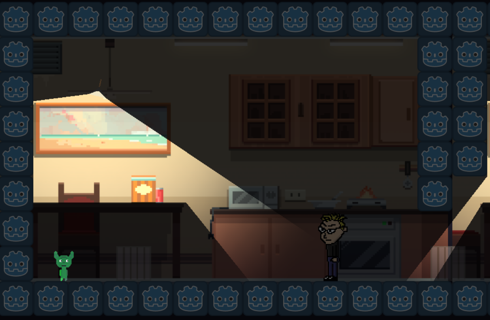

---
title:
- Theory and Practice of Game Design and Development
author:
- Daniel Kartin
---
\setcounter{page}{1}
\tableofcontents
\newpage

# 1. Info about your Game, Game Development Team, your role and lessons learned
The *short* trailer for the game can be seen [\color{blue}{here}](https://www.youtube.com/watch?v=CF0C61Sxbhg).

The game binaries for Linux, Mac, and Windows can download from [\color{blue}{here}](https://tinyurl.com/nightmare-hotel), please download the entire folder that is needed for your platform.

## 1.a Your game?
Nightmare Hotel

## 1.b GameDev Team
FrandseGames

## 1.c Team members
Jens Jakúp Gaardbo, Fredrik Dam Hansen, Simon Frandsen, Daniel Kartin, Søren Skouv

## 1.e Common vision
Stealth Goblin Action.

## 1.f Your role
I primarily worked with Game design, level design, programming, 2D art, and animation. [394]

## 1.g Lessons Learned
1. Commit often, and write better commit messages.
2. A hacky solution is still a solution.
3. Getting everything put together in the end, takes longer than initially thought.

\newpage

# 2. Description of your game

## 2.a Gameplay genre
The game is an action[p.475, @fullerton] adventure[p.480, @fullerton] platformer[p.261, @fullerton], with a 2D side view[p.261, @fullerton]. It is mostly an action game due to the twitch reaction gameplay of the movement and "combat"[p.261, @fullerton].

## 2.b Player type(s)
The game caters to the Explorer due to the way you can explore the different rooms of the level[p.104]. But it also caters to the Collector, as you can pick up items[p.104, @fullerton].

## 2.c Player engagement
It engages the player in way of Challenge, because of the rising sense of tension, from the introduction of the light, then the enemy and then more than one enemy[p.39, @fullerton]. The premise of being a small goblin should also create engagement[p.45, @fullerton].

## 2.d Formal elements
The number of players is 1[p.58, @fullerton], it is a single player versus the game[p.59, @fullerton]. The game only has one role, being the goblin[p.58-59, @fullerton]. The objective is escaping[p.69-70, @fullerton]. Procedure is pressing Play from the main menu, with a mouse[p.74, @fullerton]. Core loop is moving around, avoiding light and enemies, and throwing boxes[p.74, @fullerton]. Resolving actions are dying from the light or an enemy, and winning by escaping[p.74, @fullerton]. Rules restricting action, player can go through walls[p.79, @fullerton]. Rules determining effects, if player in light too long, or touched by enemy, dead[p.79-80, @fullerton]. Shadow is a resource, like special terrain, player uses shadow to avoid light[p.83, @fullerton].

###### Conflict
* Obstacles: The light areas, and the navigation[p.86, @fullerton].
* Opponent: Enemies[p.86, @fullerton].
* Dilemmas: Choices of player, like wait in shadow or jump into light for movement[p.86-87, @fullerton].

## 2.e Dramatic elements
The challenge should emotionally engage the player, as the it should remain balanced between frustration and boredom[p.98-99, @fullerton]. The game allows for exploration and collecting items, something that should lend it towards the Explorer and Collector player types[p.104, @fullerton]. The goblin character should be able to be identified with by a player, due to him being trapped in the building, and many people have experienced that, which should allow for them to internalise the "story"[p.108-109, @fullerton].
[97]

## 2.f System dynamics
Includes the player, the boxes, the key, the door, the enemy, the rooms[p.130, @fullerton]. The player has a location, and can hold and throw objects, these object can activate doors, or daze enemies.

### Relationships
Player can pick up objects, and throw them, thus changing their location in the world[p.131-132, @fullerton].

The enemy activates attacking when a player is near, and stops if player goes too far away[p.131-132, @fullerton].

The stair allows for the player to go up and down between floors[p.131-132, @fullerton].

The door allows for unlocking if the key is thrown at it, and allows for ending the game if the player activates it[p.131-132, @fullerton].

\newpage

# 3. Documentation of the Physical Prototype Game Design process
## 3.a  Concept
I can't find any other concept images than this final box art cover, and a crudely drawn digital storyboard. The concept is at this point about a goblin who gets disturbed in his sleep from humans moving into his hotel, and then tries to scare them away.

{width=420px}

{width=420px}

## 3.b Physical prototype
We made the physical prototype using paper, because it is fast to iterate[p.203-204, @fullerton]. We used some paper with darkness drawn on to simulate that the rooms were unlit, and nothing was visible in there.

{width=420px}

{width=420px}

{width=420px}

## 3.c Playtest
We didn't tell the tester much else than their controller function [p.281, @fullerton]. This was to see how enemy the player interaction worked out, and how the mechanics of the light hitting the player worked.

{width=420px}

{width=420px}

## 3.d The Playcentric method
Following the playcentric approach, allowed for iterating upon the concept, using paper prototyping to test. Drawing up the concepts beforehand, and then testing it on the players allowed us to experience what an actual player would do in a gameplay situation[p.12,@fullerton].

\newpage
# 4. Documentation of the Digital Game Development process

## 4.a Flowchart
Making this flowchart was beneficial to the degree that it allowed us to map out every function and option that a player had, while taking it into account for the rest of game's systems[451].

{width=420px}

## 4.b Assets
The player sprite was drawn and animated in aseprite.

{width=220px}

The ventilation sprite was drawn in aseprite.

{width=220px}

The enemy sprite was drawn and animated in aseprite.

{width=220px}

## 4.c The process
Much of the work after the player movement, light systems, and ventilation, went into the creation of the individual rooms, and how the final level should fit together. After a room had been decided on, a member got working on the content of it, including the art assets.

{width=420px}

{width=420px}

{width=420px}

## 4.d Playtest
We tested like this, not telling anything to the players, to see how a player naturally interacted with the prototype systems.

{width=420px}

{width=300px}

## 4.e The Playcentric method
Like the physical prototype, the playcentric approach allowed for creating the rooms, testing their mechanics, and determining their engagement[p.12,@fullerton].

\newpage
# 5. Documentation of your Game Implementation

## 5.a
Link to playable binaries for Linux, Mac, and Windows can be found [\color{blue}{here}](https://mega.nz/#F!EBNHUChT!XCNV5iEsW1Eych1_TaSFhA).

## 5.b
The entire project is hosted on [\color{blue}{github}](https://github.com/totalfreak/Nightmare-hotel), the zipped (un-imported) project is around 36.9 MB.

## 5.c
For creating this game, we decided on using the Godot engine, it is an open source engine that allows for quick development of both 2D and 3D games. The graphics pipeline of Godot is OpenGl, and the physics engine is a modified version of box2D called Godot physics. Programming is all done inside the Godot editor. We used Aseprite and Piskel for the pixel art.
\newpage

#  6. Your own evaluation of your team’s game

{width=420px}

## 6.h Player experience evaluation

\newpage
# 7. Pitching and Publishing your game

## 7.a One word

## 7.b Elevator pitch
[497]

## 7.c Publish your game
QA/Polish [428]
Agile Project Planning [433]

\newpage

# Bibliography